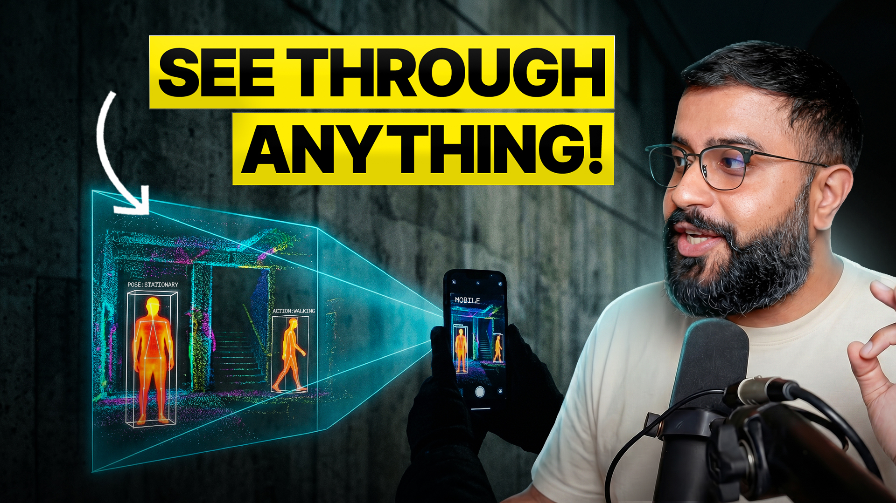

# See-Through-Walls: Multiplayer AR with MultiSet VPS

Creator demo by [Bilawal Sidhu](https://youtube.com/@bilawalsidhu), from [spatialintelligence.ai](https://spatialintelligence.ai) — multiplayer AR "wall hacks" powered by MultiSet VPS and the smartphones you already own, with optional Meta Ray-Ban support.

> **Watch the video:** [See-Through-Walls VPS Demo](https://www.youtube.com/watch?v=CU02AeUCIHc)

[](https://www.youtube.com/watch?v=CU02AeUCIHc)

Built in collaboration with [MultiSet AI](https://multiset.ai). The MultiSet team maintains the sample code in this repo; MultiSet's canonical SDKs live at [MultiSet-AI on GitHub](https://github.com/MultiSet-AI).

---
# Multiplayer Sample

## What is this?

Imagine two friends standing in the same room, each holding a phone. They point their phones around, and suddenly each of them can see a little character floating where their friend is standing — even if their friend walks behind a wall. That's what this sample does.

It's a ready-to-run example that shows how to build a **shared augmented reality (AR) experience** using the MultiSet SDK. Two or more people open the app in the same physical space, the app figures out where each of them is, and everyone sees everyone else's live position as a 3D avatar in the real world. When someone walks behind a real wall, their avatar turns into a **skeleton silhouette** so you can still tell where they are — it's like having "wall vision" for your teammates.

---

## How it works (the big idea)

- **A shared map.** Before the experience starts, someone has already scanned the physical space and uploaded it to MultiSet as a "map." Every device in the session uses the **same map** as a common reference point, so when one phone says "I'm 2 meters north of the doorway," every other phone agrees on where that is.
- **Localization.** Each device points its camera around the room, recognizes the space, and figures out exactly where it is on the shared map. This step is called **localizing**.
- **Pose sharing.** Once a device knows where it is, it keeps sending its position and direction (its "pose") to the other devices over Wi-Fi, many times a second. Every device uses those updates to draw an avatar for each other player.
- **Skeleton-through-walls.** The app also downloads a 3D model of the room's surfaces. When the line between your camera and another player's avatar passes through a wall in that model, the avatar is swapped for a glowing skeleton so you still see it.

---

## Two ways to run it

The sample supports two different setups. Pick the one that matches the devices you have:

| Setup                        | Who plays                                         | Needs                                                                       |
| ---------------------------- | ------------------------------------------------- | --------------------------------------------------------------------------- |
| **Flow 1 — Phone ↔ Phone**  | Two (or more) people, each holding a phone        | Two phones running the Unity app. Can be any mix of iOS and Android.        |
| **Flow 2 — iPhone ↔ Glasses** | One person with an iPhone, one wearing Ray-Bans | iPhone running the Unity app **as host**, plus an iPhone-paired pair of Meta Ray-Ban glasses running the companion `MultisetRayBanTracking` Xcode app as the client. |

---

## Getting the MultiSet Unity SDK

This sample lives inside the MultiSet Unity SDK package. If you haven't installed it yet:

1. Make sure you're on **Unity 6000.0.36f1 or later** (minimum Unity 2022.3.36).
2. In Unity, open **Window → Package Manager**, click the **+** button, choose **"Add package from git URL"**, and paste:

    ```
    https://github.com/MultiSet-AI/multiset-unity-sdk.git
    ```

3. Once installed, find **MultiSet-SDK** in the Package Manager, open the **Samples** tab, and click **Import** next to **Sample Scenes**. The scenes (including this multiplayer one) appear under `Assets/Samples/MultiSet-SDK/[version]/Sample Scenes/`.

For full SDK setup details — credentials, Universal 3D support, build settings — see the [MultiSet Unity SDK docs](https://docs.multiset.ai/quick-access/multiset-unity-sdk).

---

## The scene

Open this scene in Unity to try the sample:

`Assets/MultiSet/Scenes/MultiplayerSample/MultiPlayerSample.unity`

Inside the scene there are a few components doing the heavy lifting. You don't need to touch them to run the sample, but here's what each one is responsible for:

| Component                        | What it does                                                                                                                                                          |
| -------------------------------- | --------------------------------------------------------------------------------------------------------------------------------------------------------------------- |
| `SingleFrameLocalizationManager` | Handles the "figure out where I am on the map" step for this device.                                                                                                  |
| `MultiplayerManager`             | Sends your pose to other players and receives theirs. Also spawns the avatar models you see for each remote player.                                                   |
| `MultisetMultipeerBridge`        | A small C# wrapper that talks to the native iOS MultipeerConnectivity plugin. It **must** live on a GameObject named exactly `MultisetMultipeerReceiver` — the native code finds it by that name. |
| `NetworkUI`                      | The on-screen buttons: Start Host, Start Client, the name field, and the host IP field.                                                                               |
| `LocalizationSuccessDataHandler` | Waits for a successful localization, then tells the `MultiplayerManager` "we're ready to share poses."                                                                |
| `MapMeshColliderSetup`           | Takes the 3D room model that gets downloaded with the map, adds colliders to it, and hides it from the camera. Those colliders are what the skeleton-through-walls check uses. |

---

## Before you start

Do these four things once, before running the sample the first time.

### 1. Add your MultiSet credentials

Open the `MultiSetConfig` asset (inside `Assets/MultiSet/Resources`) and paste in your `clientId` and `clientSecret`. You get these from the [MultiSet dashboard](https://multiset.ai/). Without them, the app can't talk to the MultiSet servers to download maps or run localization.

### 2. Tell the scene which map to use

On the `SingleFrameLocalizationManager` component in the `MultiPlayerSample` scene, fill in **one** of the following:

- `mapCode` — if you're using a single scanned map, **or**
- `mapsetCode` — if you're using a group of related maps merged together (a "map set").

> ⚠️ **Every device that joins the session must use the exact same code.** If one phone uses map A and another uses map B, they'll each think they're in different spaces, and nobody will see anybody else.

### 3. Create a `CollisionMesh` layer

In Unity, go to **Edit → Project Settings → Tags and Layers** and add a new **User Layer** named exactly `CollisionMesh` (spelling and capitalization matter).

**Why?** The `MapMeshColliderSetup` script tags the downloaded map mesh with this layer. The skeleton-through-walls effect works by shooting an invisible ray from the camera toward each other player and checking whether it hits anything on this specific layer. If the layer doesn't exist, the effect silently breaks and players will appear as normal avatars even through walls.

### 4. Build and install the app

Build the scene for your target platform (iOS or Android) and install the resulting app on each device that will be part of the session.

> 📶 **All devices must be on the same Wi-Fi network.** The multiplayer connection goes over your local network — there's no cloud server in the middle relaying poses. No pairing code or account needed; the client just types in the host's IP address.

---

## Flow 1 — Two phones

Use this flow when each player is holding a phone. Any mix of iOS and Android works — the networking uses Unity's Netcode over UTP, which is cross-platform.

1. **Launch the app** on both devices and make sure they're both showing the **MultiplayerSample** scene.
2. **Enter a name** on each device. This is just a label so players can tell each other's avatars apart.
3. **On Device A (the host):** tap **Start Host**. This device will be the one everyone else connects to.
4. **On Device B (the client):** type Device A's **IP address** into the input field, then tap **Start Client**. When the connection works, the status text changes to *"Connected to host."*
5. **Localize.** Point each device's camera around the mapped space and trigger a localization from the scene's UI. The device will compare what it sees to the map and figure out where it is. **Both devices have to finish localizing before any avatars appear** — until then, neither phone knows where the other is in the shared space.
6. **Play.** Once both devices are localized, each phone shows the other player's avatar at their real-world position. Walk behind a wall that's part of the mapped geometry and your avatar will switch to a skeleton silhouette on the other person's screen — and vice versa.

### How to find the host's IP address

- **iOS** — *Settings → Wi-Fi → tap the (i) next to the network name → look for IP Address.*
- **Android** — *Settings → About phone → Status* (on some phones it's under *Settings → Network & internet → Wi-Fi → (network name) → View more*).

The IP usually looks like `192.168.1.42` or `10.0.0.17`.

---

## Flow 2 — iPhone + Meta Ray-Ban glasses

Use this flow when one person is wearing Meta Ray-Ban glasses and the other is holding an iPhone. In this setup, the glasses don't run Unity themselves — a companion iOS app does the heavy lifting and forwards data from the glasses.

**Roles are fixed:**

- The **Unity app** is always the **host**, and it must run on **iOS**.
- The **`MultisetRayBanTracking` Xcode app** is always the **client**. It pairs with the Meta Ray-Ban glasses, grabs video from them, localizes that video on the iPhone, and forwards the resulting pose to the Unity host.

### Prerequisites

1. **On the iPhone that will pair with the glasses**, install the **Meta AI** app, pair your Ray-Ban Meta glasses with it, and turn on **Developer Mode** in the Meta AI app's settings. Without Developer Mode, the wearable app can't request camera access from the glasses.

2. **Clone and build the companion iOS app:**

    ```bash
    git clone https://github.com/bilawalsidhu/see-through-walls.git
    open see-through-walls/Multiset-RayBan-Tracking/MultisetRayBanTracking.xcodeproj
    ```

    Build and install `MultisetRayBanTracking` (iOS 17+, Xcode 15+) onto the paired iPhone.

3. **Add your MultiSet credentials to the iOS app.** In the `MultisetRayBanTracking` Xcode project, set `MULTISET_CLIENT_ID` and `MULTISET_CLIENT_SECRET` as build settings (or as a quick fallback, fill in `defaultClientID` / `defaultClientSecret` in `MultisetRayBanTracking/Services/LocalizationConfig.swift`).

   > **Note:** `CLIENT_TOKEN` / `META_APP_ID` are not required just to build the project or review the app UI. They are required for actual Meta Ray-Ban pairing and streaming, so set them in Xcode according to your Meta DAT setup before testing with glasses.

4. **Match the map code.** Open the `MultisetRayBanTracking` app's **Settings screen** (gear icon) and enter the **same `mapCode` / `mapsetCode`** you set on the `SingleFrameLocalizationManager` in the Unity scene. If these don't match exactly, the two sides won't agree on the shared space.

### Steps

1. **On the Unity device (iPhone running the Unity app):** open the `MultiplayerSample` scene, type a host name, and tap **Start Host**.
2. **On the wearable device (the iPhone paired with the glasses):** launch `MultisetRayBanTracking`, connect the Ray-Bans by tapping **"Connect My Glasses"** (a green indicator confirms they're ready), and from the feature selection screen open **Multiplayer Demo**.
3. Enter a **display name** (or accept the device-name default) and tap **Join Session**. The wearable app automatically searches the Wi-Fi network for the Unity host and connects — you don't have to type in an IP here, because Apple's MultipeerConnectivity handles discovery for you. When iOS prompts for **Local Network** permission, tap Allow.
4. Tap **Start Streaming**. The glasses start sending their live camera feed to the iPhone, which localizes that feed against the MultiSet map.
5. Once the phone has localized the stream, the glasses' pose gets forwarded to the Unity host at roughly **20 times a second**. The Unity device then shows the glasses-wearer's avatar at their real-world position, with the same skeleton-through-walls behavior as Flow 1.
6. As the glasses wearer moves around, the wearable app **re-localizes about once a second** in the background to keep the pose accurate, and the Unity host continuously updates the avatar.
7. When you're done, leaving the Multiplayer Demo screen cleanly tears down the connection and stops the video stream.

### What's happening under the hood

You don't need to know any of this to use the demo, but here's what the wearable app is actually doing:

- **Discovery and transport.** The two devices talk over Apple **Multipeer Connectivity** on your local Wi-Fi. Both sides advertise a service type called `multiset-sdk`, which is how the wearable client recognizes a valid MultiSet host and auto-joins it. Once connected, no internet is required between the two devices.
- **Two kinds of messages.** Pose updates (position + rotation) are sent as **unreliable datagrams at ~20 Hz** — freshness matters more than guaranteed delivery, so an occasional dropped frame is preferable to waiting for a resend. Player identity (your display name and a randomly assigned vibrant color used for your avatar) is sent **reliably**, so the host always knows who you are.
- **Fast re-localization.** Re-localization during multiplayer uses a **video-frame fast path** rather than taking a fresh still photo each time — this avoids a Bluetooth round-trip to the glasses and keeps the pose responsive.
- **Silent updates.** Unlike the navigation demo, re-localization in multiplayer runs **silently** — no success/failure chimes play through the glasses speakers, so the host experience isn't interrupted.
- **Coordinate system.** Multiplayer uses a **left-handed coordinate system** (matching Unity's default), so poses from the wearable client drop directly into the Unity host's world with no conversion. Under the hood, the localization API is called with `isRightHanded=false`.

---

## Related files & links

- **Unity sample scene and scripts** — `Assets/MultiSet/Scenes/MultiplayerSample/`
- **Meta Ray-Ban companion app** — [see-through-walls](https://github.com/bilawalsidhu/see-through-walls.git), iOS target `MultisetRayBanTracking` (in `Multiset-RayBan-Tracking/`)
- **MultiSet dashboard** (to get credentials and manage maps) — [multiset.ai](https://multiset.ai/)
